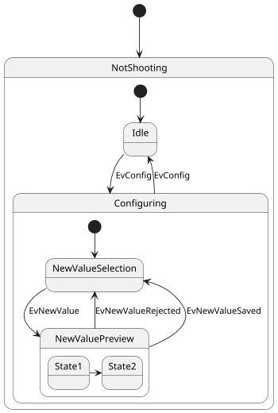
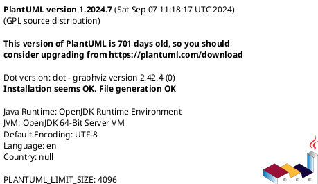

# はじめに
VSCode の PlantUML 拡張でステートマシン図を作成したところ、**公式サンプルと異なる表示**になりました。

調査の結果、**次の設定変更で解決できました。**

- PlantUML のレンダリング方法の設定を変更（ローカル -> サーバー）
- (ローカルでレンダリングする場合) `plantuml.jar` を更新

https://plantuml.com/ja/

https://marketplace.visualstudio.com/items?itemName=jebbs.plantuml

# 記事の流れ
- **発生した問題の概要**
- **問題の原因調査**
- **解決策の詳細**

の順で記載していきます。

対処法のみを知りたい方は `PlantUML の設定方法と描画オプション` まで飛ばしてください。


# 発生事象
## **公式サンプルと VSCode の描画結果の違い**
公式サイトの`状態図` `合成状態` のコードをコピペして、VSCode 上で表示させました。
記載されていた例は以下の通りです。

https://plantuml.com/ja-dark/state-diagram




しかし、**VSCode でのレンダリング結果では `NotShooting` の中に `Configuring` が含まれてしまいました。**

本来、**state `NotShooting`** と **state `Configuring`** は**独立したブロック**として描画されるべきです。


# 原因調査
## 1. PlantUML バージョンを確認
まず、VSCode で PlantUML のバージョンを確認しました。




以下の公式サイトにて、ブラウザ上で作図できます。
同じコードを公式サイトでも実行してみます。

https://www.plantuml.com/plantuml/uml/


今回の問題は、**VSCode の PlantUML バージョンが古い**ため、最新の PlantUML 仕様と異なる挙動になっていたことが原因でした。

## 2. VSCode 拡張機能の設定を確認
次に、PlantUML の描画設定をチェックしました。

以下が定番の PlantUML VSCode 拡張です。
この拡張機能の設定は、`plantuml.~` というキーで管理されています。

https://marketplace.visualstudio.com/items?itemName=jebbs.plantuml

VSCode にて `Ctrl + ,` で設定を開き、検索欄に `plantuml` と打ち込みます。

この設定が、**PlantUML の描画結果に大きく影響します。**

```
Plantuml: Render
ダイアグラムのエクスポートとプレビューの描画方法を選択します。
Local: 伝統的なローカルで描画する方法です。あなたはまずはじめに JAVA と GraphViz を設定する必要があります。
PlantUMLServer: "plantuml.server" の設定で指定されたサーバーでダイアグラムを描画します。こちらのほうが高速ですが、別途サーバーが必要です。
デフォルトでは Local が設定されます
```

私の場合は、デフォルトのまま＝ `Local` での描画になっていました。

# PlantUML の設定方法と描画オプション
## **PlantUML の描画方法**
PlantUML には **2種類の描画方法** があります。  
環境によって適切な設定が異なるため、それぞれの違いを理解して選択しましょう。

| 描画方法 | メリット | デメリット |
|-----------|--------------------------------|--------------------------------|
| **Server** | 設定不要、常に最新バージョンを利用可能 | オフライン不可、外部サーバーに依存 |
| **Local** | オフラインでも動作、バージョンを固定できる | 手動更新が必要、環境構築の手間がある |

:::details なお、拡張公式では以下の様にメリット・デメリットが言及されています

https://marketplace.visualstudio.com/items?itemName=jebbs.plantuml

-----

Advantages and Disadvantages of PlantUMLServer Render
Advantages:

15X times faster export and much quicker preview response.
Don't have to set local enviroments if you have a server in your team.
You don't need plantuml.exportConcurrency, because it's unlimited in concurrency.
Disadvantages:

Cannot render very-large diagrams (414 URI Too Long).
Cannot render diagrams with !include in it.
Less format support: png, svg, txt.
Some settings are not applicable: plantuml.jar, plantuml.commandArgs, plantuml.jarArgs.

-----

:::

PlantUML 拡張のデフォルト設定は **Local** です。
今回の問題は、Local の状態で `plantuml.jar` の更新を怠っていた事により起こりました。

## 1. 描画を公式サーバーで実施
下記の通りに VSCode 設定を変更します。

```json:setting.json
"plantuml.render": "PlantUMLServer",
"plantuml.server": "https://www.plantuml.com/plantuml", // 公式サーバーを利用
```

**メリット:** 手軽、バージョン更新作業が不要  
**デメリット:** オフラインで動作不可、外部サーバーに情報が送られる


## 2. 描画をローカルで実施 & 定期的にバージョン更新
最新の `plantuml.jar` を公式サイトからダウンロードします。
利用用途に応じて適切なライセンスを選択してください。

 **一般的な利用には MIT が無難です。**

https://plantuml.com/ja/download


`plantuml.jar` を任意のフォルダに保存し、VSCode の設定ファイルでそのパスを指定します。

下記の通りに VSCode 設定を変更します。

```json:setting.json
// パスは筆者の設定例です
"plantuml.jar": "C:\\Users\\name\\.plantuml\\plantuml-mit-1.2025.2.jar",
"plantuml.render": "Local",
```

**メリット:** オフラインでも動作、情報を外部に出さない、バージョンを固定できる
**デメリット:** 設定が手間、更新作業が必要
