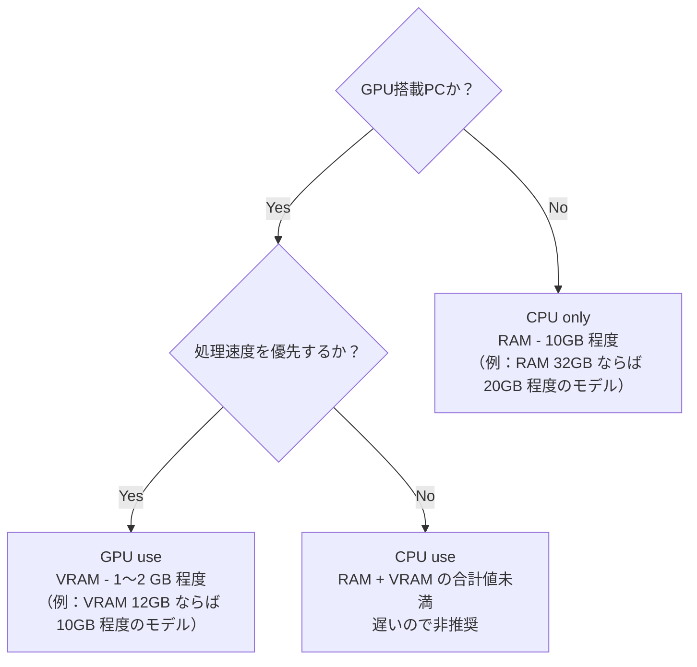

# 概要
- 下記セッティングをdocker-composeを用いて簡易化
    - docerで環境構築
    - ollamaでDeepSeekを実行
    - open-webuiでWebUIを実装
    - GPU使用の有無に合わせた設定
- PCスペックに合わせたモデル選択方法とモデルデータの探し方

# 対象読者
- Dockerを導入済みの方
- DeepSeek-R1 ローカル環境をChatGPTみたいなUIで動かしたい方

# 筆者の環境
- Windows11 WSL2（2.3.26.0）
- Ubuntu（22.04.3 LTS）
- Docker Desktop（27.3.1）
- PCスペック：RTX 4070 VRAM 12GB / RAM 32GB

# 環境構築
docker-compose.yml を作成します。
下記は ollama、open-webui リファレンスに記載されているdockerコマンドをcompseに書き換えたものです。
注意点や追加したコマンドには #コメント を入れています。

https://github.com/ollama/ollama
https://github.com/open-webui/open-webui

:::message
CPU only、又は、NVIDIA GPU を対象としています。AMD GPU の方は[dockerhubのollamaページ](https://hub.docker.com/r/ollama/ollama)をご確認ください。
:::

GPUの有無で作成する docker-compose.yml の内容が変わります。

## CPU only(ノートPC等、GPU未搭載PCの場合)
```docker:docker-compose.yml
services:
  ollama:
    image: ollama/ollama
    container_name: ollama
    environment:
      - OLLAMA_KEEP_ALIVE=5m # default:5m, Model unloads after 5 minutes, -1 for unlimited
    ports:
      - "11434:11434"
    volumes:
      - ollama:/root/.ollama # Using volumes. Not recommend bind mounts, model loading too long

  open-webui:
    image: ghcr.io/open-webui/open-webui:main
    container_name: open-webui
    ports:
      - "3000:8080"
    environment:
      - WEBUI_AUTH=False # Skip registration screen
    volumes:
      - open-webui:/open-webui:/app/backend/data
    restart: always
    extra_hosts:
      - "host.docker.internal:host-gateway"

volumes:
  ollama:
  open-webui:
```

## NVIDIA GPU(GPU搭載PCの場合)

```docker:docker-compose.yml(GPU使用)
services:
  ollama:
    image: ollama/ollama
    container_name: ollama
    environment:
      - OLLAMA_KEEP_ALIVE=5m # default:5m, Model unloads after 5 minutes, -1 for unlimited
    deploy: # Add for using GPU
      resources:
        reservations:
          devices:
            - driver: nvidia
              count: all
              capabilities: [gpu]
    ports:
      - "11434:11434"
    volumes:
      - ollama:/root/.ollama # Using volumes. Not recommend bind mounts, model loading too long

  open-webui:
    image: ghcr.io/open-webui/open-webui:main
    container_name: open-webui
    ports:
      - "3000:8080"
    environment:
      - WEBUI_AUTH=False # Skip registration screen
    volumes:
      - open-webui:/open-webui:/app/backend/data
    restart: always
    extra_hosts:
      - "host.docker.internal:host-gateway"

volumes:
  ollama:
  open-webui:
```

## (NVIDIA GPU のみ)必要ソフトウェアのインストール
NVIDIA Container Toolkit のインストールと設定が必要となります。
PowerShellでWSL2のシェルを起動します。
```powershell:PowerShell
wsl
```
NVIDIA Container Toolkit をダウンロードする前準備を行う。
```:SHELL
curl -fsSL https://nvidia.github.io/libnvidia-container/gpgkey \
    | sudo gpg --dearmor -o /usr/share/keyrings/nvidia-container-toolkit-keyring.gpg
curl -s -L https://nvidia.github.io/libnvidia-container/stable/deb/nvidia-container-toolkit.list \
    | sed 's#deb https://#deb [signed-by=/usr/share/keyrings/nvidia-container-toolkit-keyring.gpg] https://#g' \
    | sudo tee /etc/apt/sources.list.d/nvidia-container-toolkit.list
sudo apt-get update
```
NVIDIA Container Toolkit をインストール。
```:SHELL
sudo apt-get install -y nvidia-container-toolkit
```
インストールが完了しているか確認する。
```:SHELL
sudo reboot
nvidia-smi
```
以下の様な表示がでればインストール完了です。
```:SHELL
$ nvidia-smi
Sun Feb  2 23:19:04 2025
+-----------------------------------------------------------------------------------------+
| NVIDIA-SMI 560.35.02              Driver Version: 560.94         CUDA Version: 12.6     |
|-----------------------------------------+------------------------+----------------------+
| GPU  Name                 Persistence-M | Bus-Id          Disp.A | Volatile Uncorr. ECC |
| Fan  Temp   Perf          Pwr:Usage/Cap |           Memory-Usage | GPU-Util  Compute M. |
|                                         |                        |               MIG M. |
|=========================================+========================+======================|
|   0  NVIDIA GeForce RTX 4070        On  |   00000000:06:00.0  On |                  N/A |
|  0%   42C    P8             12W /  200W |    1420MiB /  12282MiB |      1%      Default |
|                                         |                        |                  N/A |
+-----------------------------------------+------------------------+----------------------+

+-----------------------------------------------------------------------------------------+
| Processes:                                                                              |
|  GPU   GI   CI        PID   Type   Process name                              GPU Memory |
|        ID   ID                                                               Usage      |
|=========================================================================================|
|    0   N/A  N/A        25      G   /Xwayland                                   N/A      |
|    0   N/A  N/A        36      G   /Xwayland                                   N/A      |
+-----------------------------------------------------------------------------------------+
```
NVIDIAのGPUをDockerコンテナ内で使用できるように設定します。
```:SHELL
sudo nvidia-ctk runtime configure --runtime=docker
sudo systemctl restart docker
```

# コンテナの起動
作成した docker-compose.yml を用いてコンテナを作成＆起動します。
```:PoweShell
docker compose up -d
```

# モデルのダウンロード
- ollama からダウンロード
- Hugging Face からダウンロード

の2パターンを紹介します。
本項では比較的多くのPCで動作可能と思われる軽量モデルを例として手順を記載しています。
モデルの選び方は後述します。

ollamaコンテナに入る。
```:PoweShell
docker compose exec ollama bash
```
モデルをダウンロードする。
```:SHELL
# ollama からダウンロード
# ollama pull <model_name>:<tag>
ollama pull deepseek-r1:1.5b

# Hugging Face からダウンロード
# ollama pull hf.co/<user_name>/<model_name>:<tag>
ollama pull hf.co/unsloth/DeepSeek-R1-Distill-Qwen-1.5B-GGUF:Q2_K_L
```
この様な出力となればダウンロード完了です。
```:SHELL
# ollama pull deepseek-r1:1.5b
pulling manifest
pulling aabd4debf0c8... 100% ▕███████████████████████████████████████████████████████▏ 1.1 GB
pulling 369ca498f347... 100% ▕███████████████████████████████████████████████████████▏  387 B
pulling 6e4c38e1172f... 100% ▕███████████████████████████████████████████████████████▏ 1.1 KB
pulling f4d24e9138dd... 100% ▕███████████████████████████████████████████████████████▏  148 B
pulling a85fe2a2e58e... 100% ▕███████████████████████████████████████████████████████▏  487 B
verifying sha256 digest
writing manifest
success
```

https://ollama.com/library/deepseek-r1:1.5b
https://huggingface.co/unsloth/DeepSeek-R1-Distill-Qwen-1.5B-GGUF

# WebUIでモデルを実行
任意のブラウザで [http://localhost:3000](http://localhost:3000) にアクセスします。
これで、ChatGPTの様な画面でチャットが出来ます。

画面左上からプルダウンで使用するモデルを選べます。


# モデルのパラメータ設定
この段階で十分にチャットAIとして使用可能ですが、せっかくのローカル環境ですので細かい設定も紹介します。
本項ではDeepSeek-R1公式の推奨設定[^1]を反映させてみます。

WebUIの画面右上端、ユーザーアイコンの左側のコントロールボタンを押します。
パラメーター一覧が表示されるので、下表の通りに設定します。


| 項目 | 設定値 | 備考 |
| ---- | ---- | ---- |
| システムプロンプト | (空欄のまま) | すべての指示はユーザープロンプト内に含める |
| 温度 | 0.6 | 0～1 値が大きいほど回答のランダム性が高くなる(0.5～0.7の範囲内で設定、推奨は0.6) |

これで完了ですが、設定可能な項目は多岐に渡ります。
用途に合わせて最適化していきましょう。
例えば
最大トークン数を上げれば長文回答が可能となり、長いコードの出力に有用かもしれません。
温度、トップP、トップK を変更すれば回答のランダム性を調整できます。
（公式では推奨されていませんが）システムプロンプトによく使う文言を入れても良いでしょう。

参考になる記事
https://zenn.dev/rk_tech/articles/18f5fe59c7b220

# モデルの選び方
## モデルサイズとPCメモリサイズ
GPU未搭載PCの場合、メモリ（RAM）より大きさい容量のモデルは動かせません。
また、モデルの他にOS等もメモリを消費する点を考慮する必要があります。

GPU搭載PCでは、GPU専用メモリ（VRAM）とモデルどちらが大きいかで処理速度が段違いに変わります。
高速な処理を求めるならば、VRAM - 1～2 GB 程度のモデルを選択すべきです。



:::message
GPU VRAM を超えるサイズのモデルを使用する場合、GPUではなくCPUで処理が行われる為、処理が遅くなります。
モデルによって差はありますが、GPU動作ならばノンストレス、CPU動作だと一般的なチャットAIの2倍強の回答時間となり実用性がないと感じました。
:::

## 蒸留/量子化
DeepSeek-R1のモデルサイズは650GBを超えており、一般家庭向けPCで動かす事は現実的ではありません。
その為、様々な手法でモデルサイズの削減が行われ、派生モデルとして公開されています。
「蒸留」->「量子化」の順に軽量化が行われる為、この順番で使用モデルを絞り込んでいくとスムーズです。

:::message
技術的な解説は省略しています。
詳細は先人の方々が作成してくださった記事をご確認ください。
:::
https://zenn.dev/hellorusk/books/e56548029b391f/viewer/intro3
https://qiita.com/Nurkic/items/a382fc84a34fd0ae9400

### 蒸留モデル
蒸留では、DeepSeek-R1（サイズ大）を教師役として小サイズの既存モデルを訓練する事で、DeepSeek-R1 っぽい性能を持ったモデルを作成しています。
DeepSeek-R1 の公式配布ページでは6種類の蒸留モデルが公開されています。
名前の見方は以下の通り。
```
# <model_name>-Distill(蒸留の意)-<base_model_name>-<パラメーター数>
DeepSeek-R1-Distill-Qwen-1.5B
```
基本的にはパラメーター数（～Bと書かれている数字）が大きいほど、大きいモデルサイズ、高精度、であるといえます。
モデルによってbase_modelが異なる為、パラメーター数のみに固執せず、実際に使い勝手を確認すべきです。

この段階では、（パラメーター数 / 2） < VRAM or RAM となるモデルを候補に選ぶと良いでしょう。

:::message
RTX 4070 VRAM 12GB を例にモデルを選んでみます。
DeepSeek-R1-Distill-Qwen-32B は大きすぎる（32 / 2 = 16 > VRAM 12GB）。
DeepSeek-R1-Distill-Llama-8B、DeepSeek-R1-Distill-Qwen-14B が候補となりそうです。
:::

|Model|Base Model|
|----|----|
|DeepSeek-R1-Distill-Qwen-1.5B|	Qwen2.5-Math-1.5B|
|DeepSeek-R1-Distill-Qwen-7B|	Qwen2.5-Math-7B|
|DeepSeek-R1-Distill-Llama-8B|	Llama-3.1-8B|
|DeepSeek-R1-Distill-Qwen-14B|	Qwen2.5-14B|
|DeepSeek-R1-Distill-Qwen-32B|	Qwen2.5-32B|
|DeepSeek-R1-Distill-Llama-70B	|Llama-3.3-70B-Instruct|

https://huggingface.co/deepseek-ai/DeepSeek-R1

### 量子化モデル
蒸留モデルのままでは依然としてモデルサイズが大きい為、量子化による軽量化が行われます。
各モデルは32bitで表現される数値をパラメーターとして所持しています。
この数値を16bitや4bitに変換する事でモデル自体のサイズを削減したのが量子化モデルです。

|ビット精度	|サイズ（8Bの場合）|削減率　|性能への影響|
|----|----|----|----|
|32bit	|32.00GB	|0%	|基準|
|16bit	|16.00GB	|50%	　|皆無|
|8bit	|8.00GB	|75%	　|小（許容できる範囲）|
|4bit	|4.00GB	|87.5%	|中（量子化手法によっては使える）|
|2bit	|2.00GB	|93.75%	|大（非推奨）|

名前の見方は以下の通り。
```
# <model_name>-Distill(蒸留の意)-<base_model_name>-<パラメーター数>-<量子化手法>
DeepSeek-R1-Distill-Llama-8B-Q4_K_M

# Q<bit数>_<量子化手法>
Q4_K_M
```

見るべきは量子化数と手法の2点です。

・量子化数
可能ならQ6やQ8以上を選ぶべきです。体感的にQ4までなら使えます。
Q2は性能低下が大きいので、より小さい蒸留モデルのQ4以上の量子化モデルを選ぶ方が良いかと思います。
一般的に、モデルサイズが小さい方が実行速度が速い傾向があります。
速度を求める場合、あえてQ8以上ではなくQ4を選ぶのも手です。

・量子化手法
「K」がおすすめです。「0」や「1」は旧手法となります。
「K」は末尾に文字が付いていますが、「K-S」<「K-M」<「K-L」の順でサイズと性能が高いです。

:::message
なお、ollamaで選択できるモデルは量子化手法がモデル名に反映されていない事が多いです。
記載がない場合はQ4_K_Mで量子化されています。
例えば、ollama で DeepSeek-R1-8b を見ると、model quantization:Q4_K_M と記載されています。
（分かりにくいから蒸留と量子化はモデル名に含めてほしい...）
:::

-----
#### 量子化モデルについて補足
こちらは英語文献ですが、量子化によるモデルサイズの変化量やベンチマーク結果（推論速度）が整理されています。

https://gist.github.com/Artefact2/b5f810600771265fc1e39442288e8ec9

また、量子化で性能がどの程度下がるのかはモデルによって傾向が違うようです。

https://qiita.com/wayama_ryousuke/items/50e36d0dcb37f8fb7dd8

こちらの記事では、FP16～Q2_K までの量子化具合による回答文を比較されています。
Q3までサイズを落とすと目に見えて性能が低下しますが、Q4 と FP16 の違いはイマイチ掴めません。

https://qiita.com/keisuke-okb/items/b8092ed946bcf3864295

質問するジャンル（アイデア出し、コーディングの質問など）によって得意不得意の傾向も変わる可能性があるでしょうから、実際に試して比較する事が重要かと思います。

:::message
で、結局、何を選べばいいの？
第一選択：Q4_K_L or Q4_K_M
精度を上げたい：Q8_0 or FP16（32bit、16bit は Q16 ではなく FP16 表記）
精度を犠牲にしてでも動かしたい：IQ2_K_L or IQ2_K 
:::

-----


## ファイル拡張子
LLMを探しているとよく見かける拡張子は以下の通りです。
ollamaでは.GGUF拡張子のモデルファイルを使用します。

|拡張子|セキュリティ|特徴|
|----|----|----|
|ckpt|低|古い形式、非推奨|
|safetensors|高|汎用的な形式|
|GGUF|高|実行速度が速い、ollamaなど一部のソフトが対応している|

ollamaのWEBサイトからモデルをダウンロードする場合は、意識せずともGGUFになっています。
Hugging Face からダウンロードする場合はGGUFとなっているか確認が必要です。
量子化モデルだと、大抵はGGUFファイルで配布されている印象です。

一方、safetensorsしかない場合は、ollamaにGGUFへ変換する機能があります。
量子化されていないモデルはsafetensorsで配布されています。
とはいえ、探せばGGUFに変換されたモデルが公開されていると思います。

https://zenn.dev/k_zumi_dev/articles/1c752e21c6406f

# モデルダウンロードページの見方
初見だと戸惑う事もあるかと思うので、各サイトでのモデルの探し方を紹介します。

## ollama
ollama webサイトにて「DeepSeek-R1」と検索する。

https://ollama.com/


1つのLLMに対して複数のtag（蒸留/量子化の種類）が登録されている事があります。
tagを選ぶと該当のモデルデータ（画像だとdeepseek-r1:1.5b）が表示されます。
modelを押すと、蒸留/量子化といった情報が確認できます。

親切なことに、ページ中にダウンロード用のコマンドが記載されています。
run を pull に書き換えればそのまま使用可能です。


## Hugging Face
DeepSeek-R1 の配布ページにアクセスします。
https://huggingface.co/deepseek-ai/DeepSeek-R1

下にスクロールして DeepSeek-R1-Distill Models という見出しを探します。
Download欄に各蒸留モデルのリンクが記載されているので、アクセスします。


:::message
本項の例では、DeepSeek-R1-Distill-Qwen-1.5B を選びます。
:::

DeepSeek-R1-Distill-Qwen-1.5B ページを少し下にスクロールすると、画面右部に Model tree for
deepseek-ai/DeepSeek-R1-Distill-Qwen-1.5B という欄が確認できます。
Quantizations の横にある 93 models をクリックします。


DeepSeek-R1-Distill-Qwen-1.5B を量子化したモデルが一覧表示されます。
人気順になっているので、上側を選ぶのが無難かと思います。


:::message
bartowski/DeepSeek-R1-Distill-Qwen-1.5B-GGUF が量子化モデルの種類が多く、各モデルの評価コメントやモデルサイズが表で整理されており分かりやすそうです。
bartowskiさんが作成されたモデルを選びます。
:::

https://huggingface.co/bartowski/DeepSeek-R1-Distill-Qwen-1.5B-GGUF

画面右側には、配布されている量子化モデルの「bit数」と「手法」が一覧になっています。
先述した量子化モデルの探し方を参考に、PCスペックに見合ったモデルを選びます。


# 雑記
1/20にモデルが公開され1/24の段階でウキウキしながらローカル環境を作っていたのですが、dockerコマンドの紹介はあるがdocker composeへ落とし込まれていなかったり、モデルの選び方が簡略だったりと大変でした。
その為、知識の整理も兼ねて網羅的な記事を作ろう思い、最終的には1万文字を超えていました。誰かの一助になれば幸いです。

[^1]:[https://github.com/deepseek-ai/DeepSeek-R1](https://github.com/deepseek-ai/DeepSeek-R1) Usage Recommendations参照